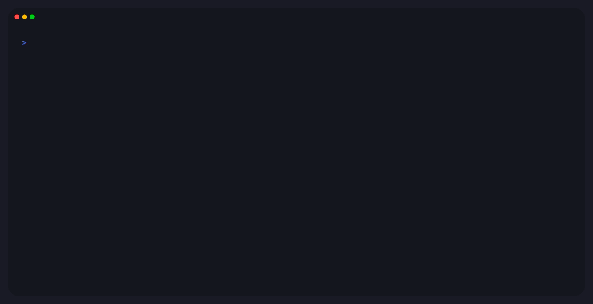

# Peek

> See and drive any Mac app — from your terminal or your AI agent.

<p align="center">
  
</p>

Inspect any UI, click any button, fire any shortcut, drag any tab, type into any field, snap any window, hit-test any pixel. Peek does all of it with structured output — perfect for scripts and AI agents that need to know what just happened.

## See it in action

### Click a button, see what changed — in one call

```bash
$ peek launch --name Calculator --wait-for-window --format json
{"pid":12345,"windowID":4977,"windowTitle":"Calculator", ...}

$ peek action --app Calculator --do Press --role Button --title 5 --verify diff --format json
{
  "action": [{"role":"Button","description":"5", ...}],
  "diff": {
    "changed": [{
      "role": "StaticText",
      "before": {"value": "‎0"},
      "after":  {"value": "‎5"}
    }],
    "added":   [{"role":"Button","description":"Clear"}],
    "removed": [{"role":"Button","description":"All Clear"}]
  }
}
```

The display went from `0` to `5`, and the `All Clear` button became a `Clear` button — captured atomically in the same call that pressed the button. No second tool call to re-inspect the tree.

### Hit-test any pixel

```bash
$ peek find --app Calculator --x 902 --y 422 --format json
{"role":"Button","description":"5","frame":{"x":902,"y":422,"width":48,"height":48}}
```

Click anywhere on screen → tells you what control is there. The inverse of "find the button by name" — useful when you have a screenshot and want to know what's interactive.

### Search by attributes, not just by title

```bash
$ peek find --app "System Settings" --value "General" --format json
[
  {"role":"StaticText","value":"General","frame":{"x":339,"y":367, ...}},
  {"role":"StaticText","value":"General","frame":{"x":750,"y":171, ...}}
]
```

System Settings puts its labels in `value`, not `title` — peek lets you filter on every AX attribute, so you don't have to know which one the app chose.

### Read the menu bar — including shortcuts

```bash
$ peek menu --app Safari --find "New Tab" --format json
[
  {"role":"MenuItem","title":"New Tab","shortcut":"⌘T","path":"File > New Tab"},
  {"role":"MenuItem","title":"New Tab at End","shortcut":"⌥⌘T","path":"File > New Tab at End"}
]
```

Once you have the shortcut, fire it directly with `peek key --key t --modifiers cmd` — faster than opening the menu, and works on backgrounded apps.

## Install

### Homebrew

```bash
brew install alexmx/tools/peek
```

### Mise

```bash
mise use --global github:alexmx/peek
```

## Requirements

- macOS 15.0 or later
- **Accessibility permission** for most commands
- **Screen Recording permission** for `peek capture`

Run `peek doctor --prompt` to check and request permissions.

## Command reference

All commands accept `--format json` (default for MCP) or `--format toon` (token-optimised, ~30-50% smaller). Most accept a target via `--app NAME`, `--pid PID`, or a positional `<window-id>` (from `peek apps`).

### Discovery

| Command | Description | Key options |
|---|---|---|
| `apps` | List running applications and their windows | `--app NAME` filter |
| `launch` | Launch an app by bundle ID, name, or path | `--bundle-id` (preferred), `--name`, `--path`; `--wait-for-window` blocks until a window appears and returns `windowID`/`windowTitle` |
| `quit` | Terminate a running app | `--pid` (preferred), `--bundle-id`, `--name`; `--force` |

### Inspection

| Command | Description | Key options |
|---|---|---|
| `tree` | Accessibility tree of a window | `--depth N` |
| `find` | Search elements by AX attributes or hit-test | `--role`, `--title` (matches AXTitle OR AXDescription), `--value`, `--desc`, `--enabled true\|false`; `--x --y` for hit-test; `--limit N` (use `--limit 1` for existence checks) |
| `menu` | Inspect or click menu bar items | `--find QUERY`, `--path "Menu > Submenu"`, `--click TITLE` |

### Interaction

| Command | Description | Key options |
|---|---|---|
| `action` | Find an element and perform an AX action | `--do Press\|Confirm\|Cancel\|ShowMenu\|Increment\|Decrement\|Raise`; filters as `find`; `--all`; `--verify none\|tree\|diff` (default `none`), `--depth`, `--delay` (default 0.15s) |
| `click` | Click at screen coordinates | `--x --y`; `--count 1\|2\|3` (double = word, triple = line); `--button left\|right` (right opens context menus); `--app` to auto-activate |
| `drag` | Drag between two screen points | `--from-x --from-y --to-x --to-y` |
| `scroll` | Scroll at coordinates | `--x --y --delta-y` (positive = DOWN); `--delta-x`; `--drag` for touch apps |
| `type` | Type literal text via key events | `--text`; `--delay-ms` per-character delay (default 5) |
| `key` | Send a single key chord | `--key` (character or named: escape, tab, return, delete, arrows, home, end, pageup, pagedown, f1-f12, space); `--modifiers cmd,shift,option,control,fn` |
| `activate` | Bring an app to the foreground | `--app`, `--pid` |

### Monitoring & System

| Command | Description | Key options |
|---|---|---|
| `capture` | Screenshot a window | `--output PATH`; `--x --y --width --height` for window-relative crop |
| `doctor` | Check Accessibility + Screen Recording permissions | `--prompt` to open System Settings |
| `mcp` | Start the MCP server | `--setup` for client config snippets |

## A few representative calls

```bash
# What's behind this pixel?
peek find --app Xcode --x 280 --y 50

# Press a button and confirm the UI changed
peek action --app Xcode --do Press --role Button --desc "Run" --verify diff

# Reorder Safari tabs (positions from peek find)
peek drag --app Safari --from-x 420 --from-y 60 --to-x 220 --to-y 60

# Send a shortcut to a backgrounded app
peek key --key s --modifiers cmd --app TextEdit

# Crop a region of a window (window-relative coords)
peek capture --app Xcode --output toolbar.png --x 0 --y 0 --width 400 --height 50
```

## MCP server

Peek runs as a stdio MCP server. Every command is exposed as a `peek_*` tool (`peek_apps`, `peek_tree`, `peek_find`, `peek_action`, `peek_click`, `peek_drag`, `peek_scroll`, `peek_type`, `peek_key`, `peek_menu`, `peek_launch`, `peek_quit`, `peek_activate`, `peek_capture`, `peek_wait`, `peek_doctor`).

```bash
peek mcp --setup   # prints config for Claude Code, Cursor, Codex CLI, etc.
```

Manual configuration:

```json
{
  "mcpServers": {
    "peek": { "command": "peek", "args": ["mcp"] }
  }
}
```

`peek_wait` (MCP-only) polls for an element to appear, returning at first match — useful when waiting on UI you don't trigger directly (a dialog opens, a spinner vanishes).

A skill guide for agents driving peek via the CLI is at [`skills/peek/SKILL.md`](skills/peek/SKILL.md). Install it with [Skillman](https://github.com/alexmx/skillman):

```bash
skillman install github.com/alexmx/peek
```

## License

Released under the [MIT License](LICENSE).
